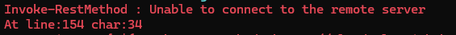

# Powershell Error

If you are getting something similiar to these in powershell then heres how you can fix it.

## Option 1 | Cloudflare WARP 

To do this method head on over to the link below and download the latest version for your operating system. (Windows in most cases.)
https://developers.cloudflare.com/cloudflare-one/team-and-resources/devices/cloudflare-one-client/download/

Once you install WARP and have it running you should see a pop up in the bottom left corner something like this.

However if you do not then you can just search for Cloudflare WARP in your search bar or system tray then it should pop up.

Once you are here you can press on next.

Then you should see something like **Your internet is not private**. 

Press the big switch to turn on Cloudflare WARP.

Once Cloudflare connects you to their services then if you were to rerun the script it should work.
If not ask for support in our Discord Server.

## Option 2 | Change your DNS

Now to do this one it's a bit more tricky. Don't worry there will be a video to explain how to do it.

- Head on over to Control Panel you can find that by searching in your Start Menu.
- You should see a few options the one we are worried about is **Network and Internet** so click on that.
- Now you should see 2 options. Click on **Network and Sharing Center**
- Now if you look to the left side of the panel you will see 3 options.
- Click on **Change adapter settings** which should open another panel.
- Now if you are either on a Wireless connection or Ethernet right click the one that you need.
- You would then select **Properties** with the little shield icon. 
- Look for **Internet Protocol Version 4 (TCP/IPv4)** click on that and press Properties again.
- Now focus on the bottom card where you will press **Use the following DNS server addresses:**.

### Cloudflare
Perferred DNS Server: 1.1.1.1
Alternate DNS Server: 1.0.0.1

### Google
Perferred DNS Server: 8.8.8.8
Alternate DNS Server: 8.8.4.4

Those are the two we recommend. I went for Cloudflare for this demonstration.

Press on OK and then rerun the script.
That should fix your problem if not feel free to try another option.

https://youtu.be/sgS2aYvGVT8

