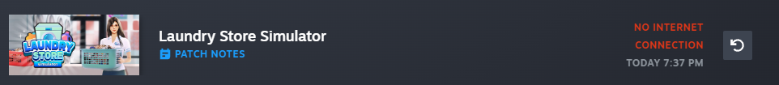
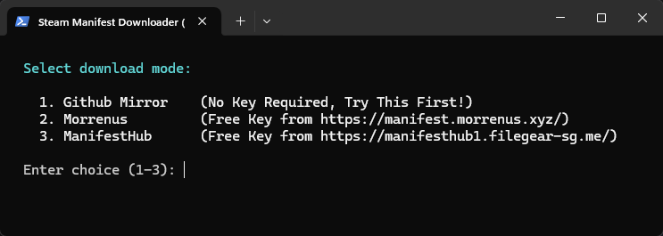
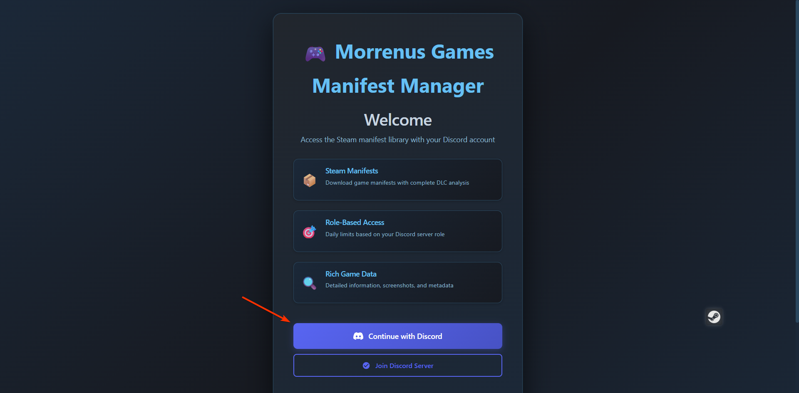
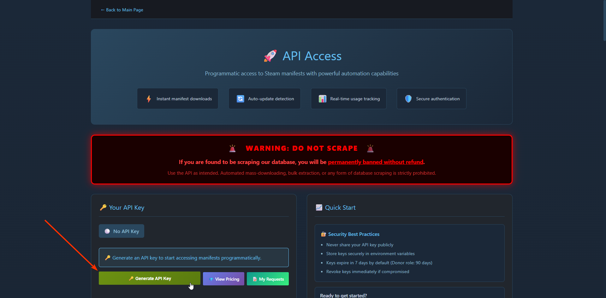
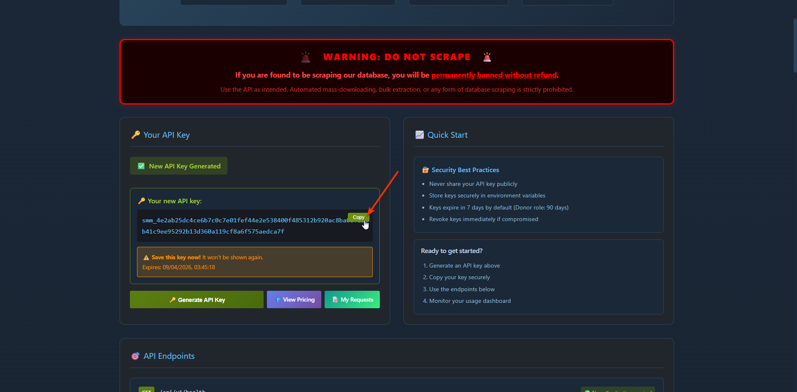
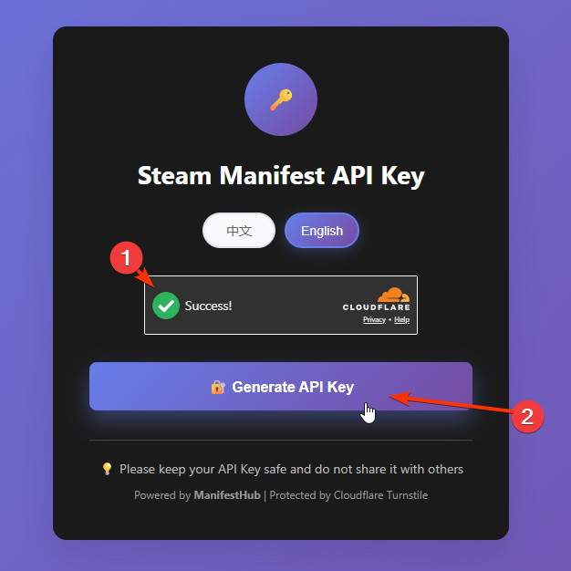
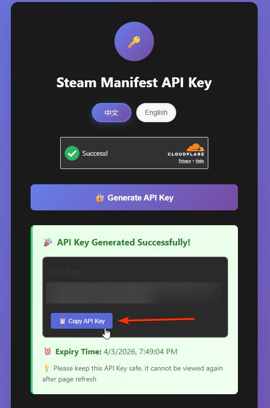

import Tabs from '@theme/Tabs';
import TabItem from '@theme/TabItem';

# "No Internet Connection" Fix (Manifest Updater)

Getting the "No Internet Connection" erro while trying to download/update a game? This script force updates your manifests so the download starts working instantly without having to rely on steamtools servers to fetch them for you.

```powershell
irm "https://luatools.vercel.app/manifests.ps1" | iex
```
Run the above in PowerShell and follow the prompts.


---


## Modes

When you run the script, you'll be asked to pick a mode:

| Mode | API Key Required | How it works |
|---|---|---|
| `Github Mirror` | No | GitHub mirror only. Fails if a manifest isn't there. |
| `Morrenus` | Yes (Morrenus) | Tries GitHub first, falls back to Morrenus on 404. |
| `ManifestHub` | Yes (ManifestHub) | Tries GitHub first, falls back to ManifestHub on 404. |

If you're unsure which to pick, try option 1 first and if depots come up as missing try option 2 or 3. I reccomend option 2 (morrenus) — it has the best coverage and a free API key. 

---

## Getting an API Key

Both keys are free.

<Tabs>
  <TabItem value="morrenus" label="Morrenus" default>

1. Go to [manifest.morrenus.xyz](https://manifest.morrenus.xyz/) and log in with Discord



2. Generate your key at [manifest.morrenus.xyz/api-keys/user](https://manifest.morrenus.xyz/api-keys/user)



3. Copy the key and save it somewhere. This key will not be shown again so if you lose it you must generate a new one.



  </TabItem>
  <TabItem value="manifesthub" label="ManifestHub">

1. Go to [manifesthub1.filegear-sg.me](https://manifesthub1.filegear-sg.me/), complete the captcha and "generate API key"



2. Generate and copy your API key from the panel



  </TabItem>
</Tabs>

---

## Skip the Prompts (Advanced)

Set these environment variables before running to automate the whole thing:

Example:
```powershell
$env:MANIFEST_MODE = "github+morrenus"
$env:MORRENUS_API_KEY = "your morrenus api key here"
$env:APP_ID = "1091500"
irm "https://luatools.vercel.app/manifests.ps1" | iex
```

No prompts — it runs, downloads, and shows a summary.

| Variable | Description |
|---|---|
| `$env:MANIFEST_MODE` | `github` / `github+morrenus` / `github+manifesthub` |
| `$env:MORRENUS_API_KEY` | Your Morrenus key (`smm_...`) |
| `$env:MH_API_KEY` | Your ManifestHub key |
| `$env:APP_ID` | Steam App ID to process (e.g. `1091500`) |

---

## What It Does

1. Reads your Steam install path from the registry
2. Reads `Steam/config/stplug-in/<AppId>.lua` for depot IDs
3. Fetches manifest IDs from the SteamCMD API
4. For each depot — skips if already downloaded, tries GitHub first, falls back if needed
5. Downloads manifests to `Steam/depotcache/`
6. Shows a summary, then asks if you want to process another game

When it's done you'll see:

```
  What would you like to do next?

    1. Process another AppID
    2. Done! (close PowerShell)
```

Pick **1** to run another game without re-entering your key.
